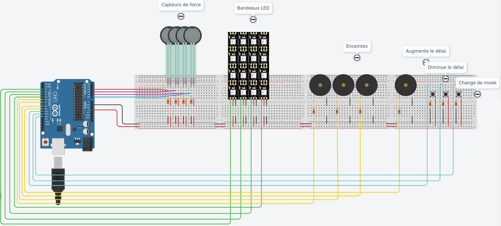

# BaseFrappeMurale

# Composants:

- Arduino Uno R3
- Capteur de force * 6
- Neopixel strip * 6
- Piezo * 6
- Bouton * 3
- Resistance * 15

# Concept

Touch.it est un concept de base de frappe murale pour s'entrainer chez soi. Le but est d'atteindre les cibles dans un temps imparti. Les cibles sont désignées une à une de façon aléatoire. Chaque cible contient une piedzo/buzzer et une bande led. Selon le mode, la bande led ou le buzzer vont s’activer, un délai permets de récupérer la pression maximale associé à la cible. Un retour de sa performance lui est donné est temps réel.
L’utilisateur peut modifier le délai entre deux coups, mais aussi cycler sur les 3 modes de fonctionnement (Son – LED – Son et LED) 

# Objectif
L’objectif de ce POC est de montrer qu’il est possible que toutes personnes puissent s’entrainer chez soi, qu’il soit déficient visuel, mal entendant ou handicap moteur léger.

