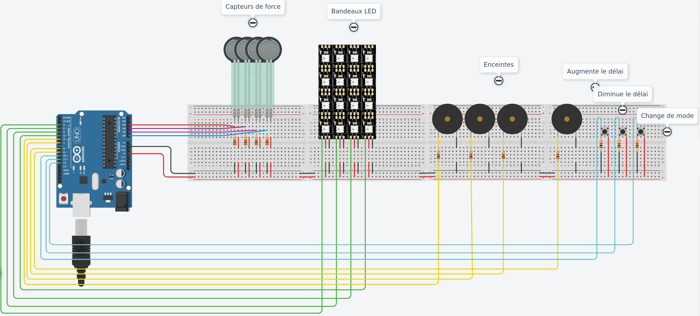
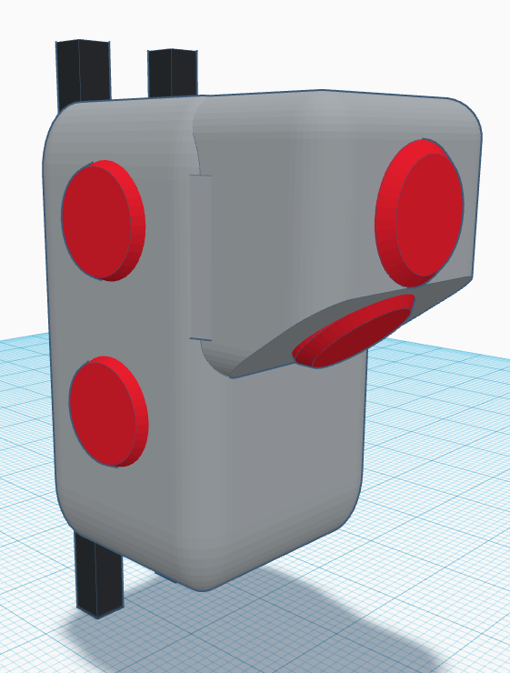
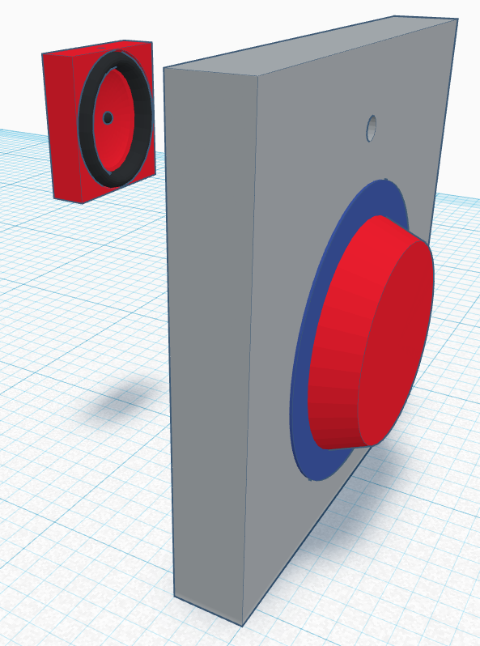

# BaseFrappeMurale

Ceci est un schéma simplifié qui ne contient que 4 zones de frappes afin d’alléger les calculs dans ThinkerCAD.

Simulation : https://www.tinkercad.com/things/cN2L4HN94If

# Composants:

- Arduino Uno R3
- Capteur de force ✕ 6
- Neopixel strip ✕ 6
- Piezo ✕ 6
- Bouton ✕ 3
- Resistance ✕ 15

# Concept

Pouch.it est un concept de base de frappe murale pour s'entrainer chez soi. Le but est d'atteindre les cibles dans un temps imparti. Les cibles sont désignées une à une de façon aléatoire. Chaque cible contient un buzzer et une bande LED. Selon le mode, la bande LED et/ou le buzzer vont s’activer, un délai permet de récupérer la pression maximale associée à la cible. Un retour de sa performance lui est donné est temps réel.

L’utilisateur peut modifier le délai entre deux coups, mais aussi naviguer entre les 3 modes de fonctionnement :
* Son et LED
* LED 
* Son

# Objectif

L’objectif de ce POC est de montrer qu’il est possible pour n'importe qui de s’entrainer chez soi, que l'on soit déficient visuel, mal entendant même avec un handicap moteur léger.

# Connexion

L'arduino est connecté à un esp8266 (wifi), ce qui lui permet d'envoyer en temps réel les informations de pression. Qui seront stocké dans un Azure Cosmos DB sous format Json.

Une application sur téléphone pourrait permettre de demander des traitements sur des azures functions afin de créer des visuels rapide pour l'utilisateur et de façon scalable.
